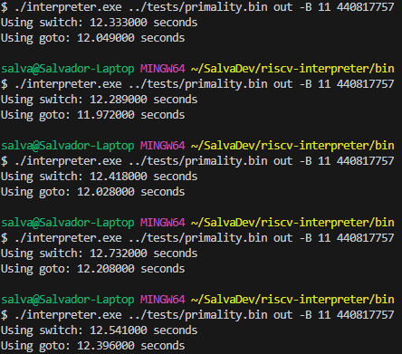

Because of the linear nature of an interpreter, it is practically impossible to use multi-process/multi-threaded optimizations without adding an unreasonable amount of overhead code to keep everything running smoothly.

Something I did to "simulate" the locality of registers in a CPU was to store the register array in the virtualmachine struct itslef instead of passing a pointer to the heap.

I tried to benchmark the intialization of the vm, the total runtime of the vm and each instruction, but Windows' clock is only accurate up to the milliseconds, which isn't accirate enough to tell the difference between instructions or even the time to initialize the vm. Therefore I just kept the overall time as a benchmark.

While looking online, I found an example of a [direct-threaded interpreter](https://eli.thegreenplace.net/2012/07/12/computed-goto-for-efficient-dispatch-tables) where instead of having a loop with a switch for each instruction's opcode, the label addresses would be stored at the corresponding opcode indices (trading off some memory waste because we need 128 entries to store 7 bits of opcode). I only did this at the opcode level (not yet at the funct3/funct7 level) and already saw a small increase in speed.

Comparing primality check of 440817757:
